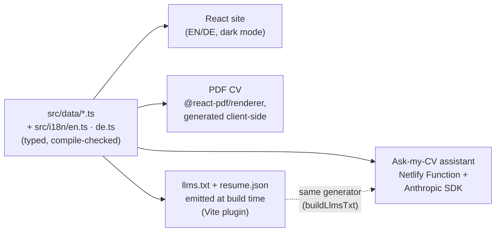

# Architecture

This document explains how the site is built and — more importantly — why it is built this way. It is deliberately honest about tradeoffs: where the simple solution is the correct one, and where the current implementation has known limits.

## One typed data source, four outputs

All facts about my work live in `src/data/*.ts` (projects, expertise, education, languages, open source, personal). The IDs in those files *derive* the `Translations` TypeScript interface (`src/i18n/types.ts`), so every project, metric, and reference key must have a translation in both `src/i18n/en.ts` and `src/i18n/de.ts` — a missing or typo'd key is a compile error, and a structural drift between the two locales fails `src/i18n/parity.test.ts`.

That single source feeds four outputs:

Consequence: adding a project means editing one data file and two translation files — the compiler enforces completeness, and the PDF, the machine-readable files, and the assistant's knowledge all update on the next build. The assistant can even answer questions about itself, because it is a project entry in the same data.

## The "Ask my CV" assistant

### Request flow

`AskCV.tsx` keeps the conversation in React state and POSTs the last 12 turns to `/.netlify/functions/ask-cv` (same-origin, so the strict CSP needs no exceptions). The function validates the payload, applies per-IP rate limiting, and makes a single non-streaming `messages.create` call — `claude-haiku-4-5`, 400 max output tokens — with a system prompt that embeds the full profile via `buildLlmsTxt()`. The reply is plain text by instruction; the widget never renders markdown or HTML from the model.

The model and limits — `claude-haiku-4-5`, 400 max output tokens, 1,000 characters per message, a 12-turn history cap, 10 requests per minute per IP — are defined at the top of `netlify/functions/ask-cv.mts`. Without `ANTHROPIC_API_KEY` the function returns 503 and the widget degrades to an email hint.

### Why this is deliberately not RAG

My CV claims retrieval-augmented systems, and this chat deliberately doesn't use one. That is the correct call, and the reasoning is the point:

- The full profile is **~2,000–3,000 tokens**. `claude-haiku-4-5` has a 200K-token context window. The entire corpus fits in ~1.5% of the context.
- Retrieval exists to solve *"the corpus doesn't fit in the prompt"* and *"most of the corpus is irrelevant to the query."* Neither problem exists here. Chunking a one-page CV, embedding it, and doing cosine similarity would add an embedding dependency, a store, retrieval latency, and recall failure modes — and could only ever *lose* information relative to sending everything.
- The senior engineering decision is matching the architecture to the corpus size, not demonstrating the fanciest pattern on a problem that doesn't need it.

RAG earns its place when the corpus outgrows the prompt. That's a different project: a standalone retrieval service (FastAPI + pgvector) over a corpus that actually needs it — see the roadmap below.

### Why prompt caching is currently a no-op (measured, not assumed)

An obvious "optimization" would be Anthropic prompt caching on the system prompt, since it's identical on every request. It would do nothing today: **the minimum cacheable prefix for `claude-haiku-4-5` is 4,096 tokens**, and this system prompt is ~2K tokens. Below the minimum, `cache_control` silently no-ops — no error, just `cache_creation_input_tokens: 0` in the usage response.

Even above the threshold, the economics need checking: cache writes cost 1.25× the base input rate (5-minute TTL) and reads ~0.1×, so caching pays off only with traffic bursts inside the TTL window. At this site's traffic and prompt size, the honest engineering decision is to not add it and document why. If the profile grows past ~4K tokens, this gets revisited with `cache_read_input_tokens` measurements, not assumptions.

### Cost envelope

Each request is roughly 2.2K input + ≤400 output tokens on `claude-haiku-4-5` ($1 / $5 per million tokens) — about **$0.004 per question**. The rate limit caps the worst case. There is nothing to optimize here yet; the interesting work (published usage/cost numbers) is on the roadmap.

### Guardrails

- **Input validation**: role whitelist, non-empty string content, per-message length cap, turn cap, last message must be from the user. Malformed payloads get a 400 before any model call.
- **Prompt rules**: answer only from the embedded profile, at most four sentences, plain text only, decline off-topic questions, refuse instruction-override attempts. Model refusals (`stop_reason: "refusal"`) map to a null reply, not an error.
- **Error taxonomy**: 405 (method), 503 (no API key), 429 (rate limit — local or upstream), 400 (invalid payload), 502 (upstream API error). The frontend distinguishes 429/503 from generic failures and offers one-tap retry where retrying can help.

### Rate limiting: honest limits of the current approach

The per-IP limiter is an in-memory `Map` inside the function module. That means: it **resets on every cold start**, it is **not shared across concurrent function instances** (the effective limit is `instances × limit`), and old IP entries are never evicted within an instance's lifetime. For a portfolio site where the limiter is a cost backstop rather than a security boundary, this is an acceptable, documented tradeoff. A durable limiter (Netlify Blobs) is planned alongside usage logging, which needs the same storage.

## Security

The CSP is strict and applies to every route (`netlify.toml`): `default-src 'self'`, no external scripts, styles, fonts, or connections. Fonts are self-hosted (`@fontsource`), so there are no CDN or Google Fonts requests. The assistant endpoint is same-origin, so `connect-src 'self'` never needed loosening. Plus `frame-ancestors 'none'`, `nosniff`, HSTS, and referrer/permissions policies.

## Testing & CI

Every pull request (and every push to `main`) runs: typecheck (`tsc -b`), ESLint, Prettier check, unit tests (Vitest + Testing Library — including the widget's error/retry paths and the EN/DE parity test), a production build, and Playwright e2e: smoke flows, an **axe accessibility scan in both light and dark mode** (WCAG 2.1 AA, including color contrast — a11y regressions fail CI), and the machine-readable file contracts. Visual-regression baselines are macOS-rendered and compared locally.

## Roadmap

In order, each independently shippable:

1. **Eval harness in CI** — golden questions in EN and DE plus a prompt-injection test suite with a canary token, run as a secret-gated CI job. Turns "reliable, testable AI" from a claim into a green badge.
2. **Streaming responses** — Netlify streamed functions + Web Streams; first tokens in ~1s instead of a 3–6s "Thinking…" placeholder, and removes the 10s sync-function timeout risk.
3. **Public unit economics** — per-request token/cost logging in Netlify Blobs, surfaced as an "answered N questions this month for $X" line under the chat; durable rate limiting lands in the same storage.
4. **A real RAG project** — standalone FastAPI + pgvector service over a corpus that genuinely needs retrieval (ingestion CLI, hybrid search only if evals justify it, citations, retrieval evals with recall@5 in its own CI). Built separately so this site's assistant stays as simple as its problem deserves.
